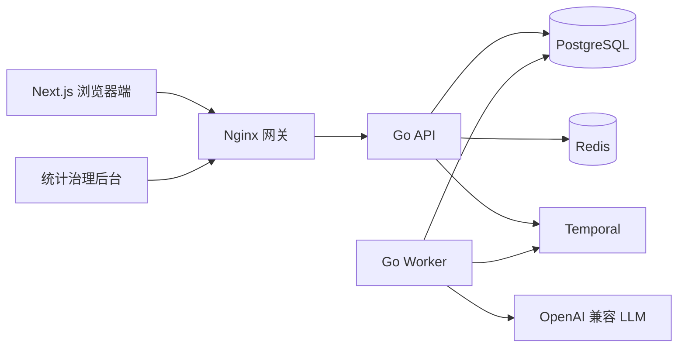
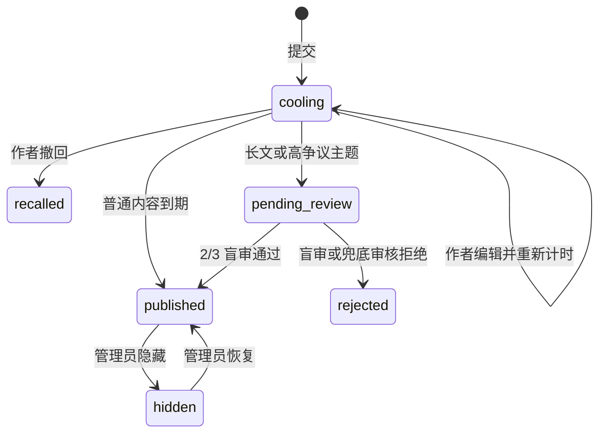

# Agora-BBS 项目开发计划与架构说明

> 文档状态：终稿实现。本文既是开发结果说明，也是新成员理解系统的入口；实现发生变化时必须同步更新。

## 1. 项目理解

Agora-BBS 不是单纯增加审核功能的传统论坛，而是把治理动作嵌入发言过程：用户先阅读，再逐步获得能力；发布后拥有冷静和撤回窗口；反馈必须说明语境；重要内容交由匿名用户与 LLM 共同校验。系统关注的是“如何形成讨论”，而不只是最终文本是否违规。

传统 BBS 的板块、主题和层级回复仍然是信息骨架。治理层通过状态机、事件日志和异步工作流叠加在骨架之上，避免长时间等待阻塞 HTTP 请求，也保证服务重启后冷静期和盲审不会丢失。

## 2. 总体架构



- Next.js 负责结构化编辑、阅读感知、冷静期反馈、讨论树、盲审和统计后台。
- 用户端与管理端共用登录入口但采用独立界面体系；管理员完成密码校验后还必须通过一次性邮箱验证码，管理 JWT 才能访问 `/admin/*`。
- Go API 负责鉴权、权限判定、同步事务、读模型和工作流启动。
- PostgreSQL 是业务事实来源；Redis 只保存可重建的缓存、限流和活跃阅读会话。
- Temporal 驱动冷静期到期、盲审截止、LLM 抽检和评论聚类。
- Worker 封装所有外部模型调用；API 请求不会直接等待 LLM。

## 3. 核心领域模型

### 3.1 渐进权限

| 等级 | 能力 | 生产默认门槛 |
| --- | --- | --- |
| L0 | 浏览、收藏 | 注册即获得 |
| L1 | 回复、语境反馈 | 1 天、有效阅读 30 分钟 |
| L2 | 创建主题 | 3 天、有效阅读 120 分钟、2 条合规回复 |
| L3 | 参与盲审 | 7 天、有效阅读 300 分钟、5 次合规互动、信任分 ≥ 20、自述通过 |

开发环境把累计阅读门槛缩短为 60/180/300 秒，并通过 Seed 提供各等级账号。新用户信任基线为 15，自述通过增加 5 分；这使行为合规的新用户具备清晰的 L3 达成路径，而负向信任事件仍会阻止升级。隐藏信任分只向管理员展示；普通用户仅看到能力和下一阶段提示。

### 3.2 内容生命周期



主题正文存为 `claim`、`evidence`、`uncertainty` 三部分。回复必须选择质疑辩论、补充论据、个人经历或单纯感谢，并通过 `parent_id` 组成讨论树。

### 3.3 阅读、反馈与审核

- 长文为结构化正文合计不少于 800 字，或分类被标为高争议。
- 长文回复需要滚动到底并在回复区停留；服务端通过会话和受限心跳累计有效时长。
- 语境反馈包含支持/质疑立场、一个语义标签和 5–120 字理由，同一用户对同一目标只有一条有效记录。
- 新用户提交社区自述后触发 3 人盲审，但不阻断账号注册和浏览。
- 重要长文优先抽取不同背景的 L3 活跃用户；2/3 通过即发布，24 小时超时或人数不足时由 LLM 兜底。
- LLM 抽检盲审公正性和反馈质量；评论达到 20 条后生成 3–8 个动态讨论标签。

## 4. API 约定

所有接口保持 `/api/v1` 前缀。响应统一为：

```json
{
  "code": 0,
  "msg": "ok",
  "data": {},
  "request_id": "request-id"
}
```

分页数据统一为 `items`、`total`、`page`、`page_size`。HTTP 状态码表达真实结果；业务 `code=0` 表示成功。接口按以下资源分组：

- `auth`、`users/me`：身份、个人资料、能力与新人自述。
- `categories`、`topics`、`posts`、`bookmarks`：论坛内容。
- `reading-sessions`：服务端阅读计时。
- `feedbacks`：语境反馈。
- `reviews/tasks`：匿名盲审队列与提交。
- `governance/policy`：前端可公开的治理参数。
- `admin`：统计、分类、用户、内容与失败任务治理。
- 管理端拆分为运营总览、用户管理、内容治理、分类管理、信任流水和 LLM 作业，并提供 7/30/90 天趋势及多维分布统计。

详细字段以 `docs/apifox/Agora-BBS.openapi.yaml` 为唯一公共契约；`docs/apifox/README.md` 提供 Apifox 导入说明，`docs/30_API文档.md` 提供中文调用说明。

## 5. 数据与兼容策略

- 不修改已发布的 `000001`；所有变化使用递增迁移并提供 down 脚本。
- 旧主题正文迁入 `structured_content.claim`，原 ID、作者和时间不变。
- 旧点赞转为 `legacy_support`，仅保留历史统计，不参与信任计算或 LLM 奖惩。
- 工作流动作使用业务幂等键，事件日志和信任流水只追加、不覆盖。
- `.env` 永不提交；仓库只保留 `.env.example`。

## 6. 实施里程碑

1. **基线与计划**：环境、配置安全、Worker 骨架、文档和网关修复。
2. **基础论坛稳定化**：增量迁移、多级回复、收藏、分页、错误契约和前端质量。
3. **治理状态机**：阅读会话、权限、结构化内容、冷静期和 Temporal 工作流。
4. **LLM 与群体治理**：语境反馈、盲审、信任流水、抽检和评论聚类。
5. **最终交付**：统计治理后台、Redis 缓存限流、生产编排、E2E 与 k6 报告。

五个里程碑均在本地 `dev-hx` 分支形成 Conventional Commits。依用户当前要求暂不推送远程；待明确要求后可推送到已配置的 `hx-origin`。

## 7. 实现结果与验收标准

- 阶段 1–4 已完成：环境安全、基础论坛、治理状态机、Temporal、真实 LLM、语境反馈、盲审、信任和聚类均已落地。
- 阶段 5 已完成：统计治理后台、Redis 缓存/限流、开发与生产编排、Seed、Playwright、k6 和运维文档均已纳入仓库。

- Go 单元/集成测试通过，`go vet ./...` 无错误。
- 前端 ESLint 零错误、TypeScript 与生产构建通过。
- 旧 version 1 数据库可无损升级，新库可重复迁移和 Seed。
- 八个开发容器健康运行，重启后冷静期和工作流状态不丢失。
- E2E 覆盖注册、阅读、解锁、发帖、回复、反馈、盲审和治理操作。
- Docker 化 k6 执行 2 分钟预热和 5 分钟 1000 req/s 读多写少场景，记录 P95、错误率、机器配置和瓶颈。

## 8. 配置与外部依赖

Docker Desktop 安装及数据目录均位于 D 盘；Go、Node、数据库、Temporal 和 k6 均从容器运行，不向 C 盘安装宿主机依赖。真实模型联调前，在本地 `backend/.env` 配置：

```dotenv
LLM_BASE_URL=https://your-provider.example/v1
LLM_MODEL=your-model
LLM_API_KEY=your-secret
```

密钥不得出现在提交、日志、测试快照或压测报告中。
